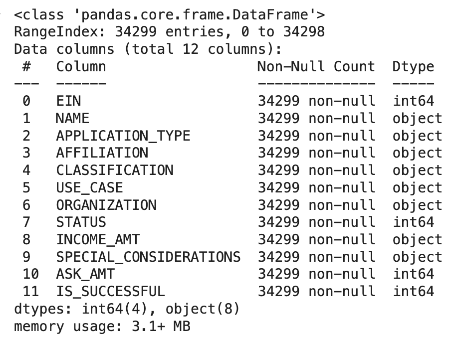

# Neural Network Analysis Report

# Overview
This assignment uses machine learning and neural networks to help select funding applicants with the best chances of success in their business ventures. The goal of the assignment was to design a neural network model to achieve higher than 75% accuracy. 

# Results
    ## Data Preprocessing
    The initial dataset had approximately 34,000 rows and 12 columns of data. 

    
    
    * Target Variable: The target variable was the binary column, "IS_SUCCESSFUL"

    * Feature Variables: The original dataset included 12 columns of data: 
        'EIN', 'NAME', 'APPLICATION_TYPE', 'AFFILIATION', 'CLASSIFICATION',
        'USE_CASE', 'ORGANIZATION', 'STATUS', 'INCOME_AMT',
        'SPECIAL_CONSIDERATIONS', 'ASK_AMT', 'IS_SUCCESSFUL'

        The 'EIN' and 'NAME' columns were dropped because they were not relevant to the model's decision process. The rest of the columns, with the exception of the target variable, were used as features in this model.

    ## Compiling, Training and Evaluating the Model
    The following steps were performed to optimize model performance:

    * Data Prep: The rare occurrences in the APPLICATION_TYPE and CLASSIFICATION  
      columns were binned, reducing them from 17 to 9 and 71 to 8, respectively. 

    * Categorical Encolding: get_dummies() was used to convert categorical variables 
      into dummy/indicator variables. 

    * Scaling: A StandardScaler() was applied to manage the distance in feature 
      ranges so that features contribute more evenly to the model.

    * Model:  The data was run through 4 separate neural network models to see if we 
      could meet a target accuracy of 75% 

      * Model 1 (nn)
            - Hidden Layer:         1
                Neurons:            5
                Activation:         Relu
            - Output Activation:    Sigmoid
            - Epochs:               100

            - Model Accuracy:       59%

      * Model 2 (nn2)
            - Hidden Layer(s):        2      
                Layer 1 Neurons:      5
                Layer 1 Activation:   Relu

                Layer 2 Neurons:      3
                Layer 2 Activation:   Relu
            
            - Output Activation:    Sigmoid
            - Epochs:               100

            - Model Accuracy:       51%

      * Model 3 (nn3)
            - Hidden Layer(s):        3                   
                Layer 1 Neurons:      7
                Layer 1 Activation:   Relu

                Layer 2 Neurons:      5
                Layer 2 Activation:   Relu

                Layer 3 Neurons:      3
                Layer 3 Activation:   Relu
            
            - Output Activation:    Sigmoid
            - Epochs:               300

            - Model Accuracy:       54%

      * Model 4 (nn4)
            - Hidden Layer(s):        3                   
                Layer 1 Neurons:      7
                Layer 1 Activation:   Tanh

                Layer 2 Neurons:      5
                Layer 2 Activation:   Tanh

                Layer 3 Neurons:      3
                Layer 3 Activation:   Tanh
            
            - Output Activation:    Sigmoid
            - Epochs:               300

            - Model Accuracy:       52%

      * Model 5 (nn5)
      The following steps were taken to further optimize the model:
        
        * The SPECIAL_CONSIDERATIONS column was dropped. 
        
        * The APPLICATION_TYPE and CLASSIFICATION columns were further binned, 
          reducing them from 9 to 6 and 8 to 6, respectively. The ASK_AMT column was also binned, reducing it from 8747 to 2.

            - Hidden Layer:         1
                Neurons:            5
                Activation:         Relu
            - Output Activation:    Sigmoid
            - Epochs:               100

            - Model Accuracy:       %71

      * Model 6 (nn6)
            - Hidden Layer(s):        3                   
                Layer 1 Neurons:      7
                Layer 1 Activation:   Relu

                Layer 2 Neurons:      5
                Layer 2 Activation:   Relu

                Layer 3 Neurons:      3
                Layer 3 Activation:   Relu
            
            - Output Activation:    Sigmoid
            - Epochs:               100

            - Model Accuracy:       71%

# Summary
The first 4 models failed to meet the target accuracy of 75%. The model was further optimized by dropping the SPECIAL_CONSIDERATIONS column, binning the ASK_AMT column. Model 5's accuracy increased to 71%. Two additional hidden layers and 10 additional neurons were added to model 6. These additional resources did not increase the accuracy at all. 
